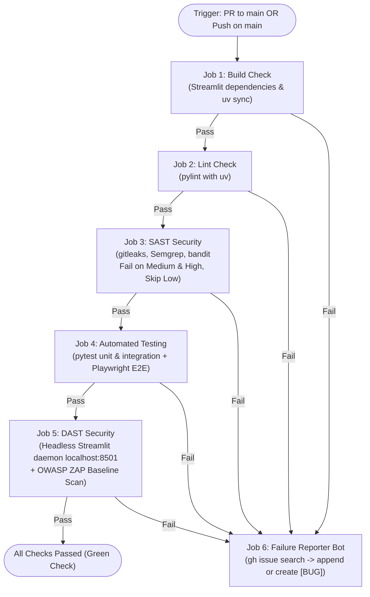

# CICD-001: Commit Actions Workflow Architecture

## Document Metadata
- **Workflow ID:** CICD-001
- **Workflow Name:** Commit Actions / Commit Quality Validation
- **Target GitHub Action:** `.github/workflows/jpra-commit-actions.yml`
- **Status:** Approved / Active
- **Author / Owner:** [@JuniorThanh]
- **Created Date:** 2026-09-27
- **Last Updated:** 2026-09-27

---

## 1. WHAT (Scope & Definition)
### 1.1 Objective
The purpose of this workflow is to manage the lifecycle of one or more commits when pushed to the remote repository. This lifecycle encompasses five stages: build check, lint check, static application security testing (SAST), automated testing, and dynamic application security testing (DAST).

### 1.2 System Scope

- **Included:** Streamlit build check (fails fast on error), lint check (pylint orchestrated with uv, fails fast on error), security check (gitleaks, Semgrep, bandit, fails fast on error), automated testing (unit and integration tests via pytest, E2E automation via Playwright, fails fast on error), and DAST with OWASP ZAP. For security findings, to avoid disproportionate blocking, findings at Medium and High severity levels must be rejected, while Low level findings are skipped.

- **Excluded:** Does not perform deployments, does not run long-running container scans such as Trivy, and does not grant excessive workflow permissions that violate Zizmor policies (ensure Zizmor workflow and pre-commit checks are maintained).

### 1.3 Key Deliverables & Outputs
If any stage of the workflow fails, a feedback bot reports a `[BUG]` issue specifying the failure reason, failure date, commit hash, failed stage/workflow, and a diagnostic summary.

---

## 2. WHY (Motivation & Rationale)
### 2.1 Problem Statement
Without continuous automated validation, commit quality degrades, security risks escalate, and technical debt accumulates. Simultaneously, unaddressed security vulnerabilities identified by SAST will lead to critical system failures.

### 2.2 Quality Goals & Benefits
- **Traceability:** Execution logs and artifacts are auditable and managed directly on GitHub Actions.
- **Compliance:** The current development team consists of a single developer, so heavyweight compliance processes are not required.
- **Risk Mitigation:** Eliminates credential leaks, static security vulnerabilities, runtime build errors, and regressions through automated tests.

### 2.3 Architectural Alternatives & Trade-offs
- **Considered Alternatives:** Client-side-only Git hooks versus server-side CI enforcement.
- **Trade-off Analysis:** Server-side CI enforcement is superior to client-side hooks because it cannot be bypassed locally. While CI-level enforcement consumes runner resources, this overhead is fully acceptable for a public repository.

---

## 3. HOW (Technical Architecture & Mechanics)
### 3.1 Execution Flow


### 3.2 Environment & Runner Requirements
- **Runner OS:** `ubuntu-latest`
- **Runtime & Tool Versions:** Python 3.11+ managed by `uv`
- **Caching Mechanism:**
  - `uv` cache: `~/.cache/uv` keyed by `uv.lock` / `pyproject.toml`
  - Playwright browser cache: `~/.cache/ms-playwright`

### 3.3 Security, Secrets & Permissions
- **Least-Privilege Scoping (Zizmor Compliant):**
  - **Top-level Workflow Permissions:**
    ```yaml
    permissions:
      contents: read
    ```
  - **Job-level Permissions:**
    - Jobs 1–5 (`build-check`, `lint-check`, `sast-security`, `automated-testing`, `dast-security`): `permissions: contents: read`
    - Job 6 (`failure-reporter`): `permissions: issues: write, contents: read`
- **Required Secrets:** Built-in `GITHUB_TOKEN` (zero external secrets required).
- **Zizmor Audit Verification:** No script injection via untrusted inputs, explicit permissions per job, pinned actions.

### 3.4 Failure Behavior & Remediation
- **On Failure:** `Job 6: Failure Reporter` runs conditionally on `if: failure()`.
- **Deduplication Logic:** The bot uses the GitHub CLI (`gh issue list --search "[BUG] Commit Actions Failure on <branch>" --state open`) to check if an open bug issue exists for the branch.
  - If found: Appends a new comment with commit hash, date, failed stage, and log extract.
  - If not found: Creates a new issue titled `[BUG] Commit Actions Failure on <branch>` with diagnostic details.
- **Remediation Guide:** Developers inspect the issue report or GitHub Actions execution tab to resolve identified defects.

---

## 4. WHEN (Trigger Strategy & Conditions)
### 4.1 Trigger Events
- **Pull Request Trigger:**
  - Events: `[opened, synchronize, reopened]`
  - Target Branches: `[main]`
  - *Note:* Draft PRs can be opened for WIP branches to obtain CI feedback without duplicate runs.
- **Push Trigger:**
  - Target Branches: `[main]` (Post-merge verification only)

### 4.2 Path & Branch Filters
- **Target Branches:** `main`
- **Path Inclusions:** All application, test, and workflow code paths.
- **Path Exclusions:** Pure documentation changes (e.g., `docs/**`, `*.md`, `LICENSE`) to save runner minutes.

### 4.3 Concurrency & Cancellation
- **Concurrency Group:** `${{ github.workflow }}-${{ github.event.pull_request.number || github.ref }}`
- **Cancel in Progress:** `true` (Superseded commits on the same branch or PR immediately terminate earlier runs).

---

## 5. Acceptance & Verification Checklist
- [X] Workflow definition passes GitHub Actions YAML schema validation.
- [X] Triggers only under specified branch/path conditions.
- [X] Triggers on pull requests and main pushes without duplicate executions.
- [X] Multi-job matrix fails fast: subsequent dependent jobs are skipped if an upstream job fails.
- [X] DAST scans local Streamlit instance and enforces Medium/High blocking thresholds.
- [X] Failure reporter bot appends comments to open issues instead of creating duplicate issues.
- [X] Scoped permissions strictly comply with Zizmor least-privilege standards.

---

## 6. Decision Date: Accepted in 2026-09-27
