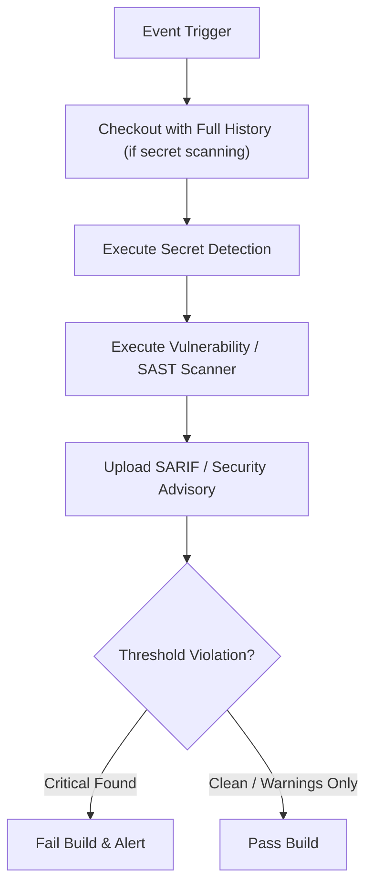

# CICD-002: Security Workflow Architecture

## Document Metadata
- **Workflow ID:** CICD-002
- **Workflow Name:** Security Scanning & Secret Detection
- **Target GitHub Action:** `.github/workflows/jpra-security.yml`
- **Status:** Draft / Proposed
- **Author / Owner:** [@JuniorThanh]
- **Created Date:** [2026-09-27]
- **Last Updated:** [2026-09-27]

---

## 1. WHAT (Scope & Definition)
### 1.1 Objective
[Define the primary role and objective of this workflow within the security scanning lifecycle.]

### 1.2 System Scope
- **Included Scanners & Checks:** [Specify tools, e.g., Gitleaks, Bandit, Trivy, pip-audit]
- **Target Assets:** [Source code, configuration files, container images, dependencies]
- **Excluded:** [Specify checks delegated to specialized tools like CodeQL or Dependabot]

### 1.3 Key Deliverables & Outputs
[List SARIF reports, GitHub Security tab alerts, security badges, or summary artifacts generated.]

---

## 2. WHY (Motivation & Rationale)
### 2.1 Problem Statement
[Describe potential vulnerabilities, secret leakage risks, or compliance failures addressed.]

### 2.2 Security Objectives & Quality Attributes
- **Confidentiality:** [Preventing accidental exposure of credentials, API keys, tokens]
- **Integrity:** [Detecting malicious dependencies or vulnerable library patterns]
- **Regulatory / Project Compliance:** [Alignment with security baselines and standards]

### 2.3 Architectural Alternatives & Trade-offs
- **Considered Scanners:** [List alternative tools evaluated]
- **Selection Rationale:** [Why the chosen scanning tools/configurations fit the project]

---

## 3. HOW (Technical Architecture & Mechanics)
### 3.1 Execution Flow


### 3.2 Environment & Tool Configuration
- **Runner Environment:** [e.g., ubuntu-latest]
- **Tool Versions & Actions:** [e.g., gitleaks-action, bandit, trivy-action]
- **Configuration Files:** [Reference project-specific security config files if any]

### 3.3 Security, Secrets & Permissions
- **GitHub Permissions:**
  ```yaml
  permissions:
    contents: read
    security-events: write
    actions: read
  ```
- **Required Secrets:** [List any required scan tokens or report upload keys]
- **False-Positive Handling:** [Strategy for suppressions, allowlists, or ignore files]

### 3.4 Failure Behavior & Escalation
- **Build Break Threshold:** [e.g., Fail on High/Critical severity, warn on Low/Medium]
- **Escalation Path:** [Immediate actions required if secrets or zero-day issues are leaked]

---

## 4. WHEN (Trigger Strategy & Conditions)
### 4.1 Trigger Events
- **Primary Events:** [e.g., `push`, `pull_request`, `schedule`]
- **Scheduled Runs:** [Cron expression for periodic baseline audits, e.g., weekly]

### 4.2 Path & Branch Filters
- **Target Branches:** [e.g., `main`, default branch]
- **Path Considerations:** [Full repository vs. targeted code paths]

### 4.3 Concurrency & Resource Limits
- **Timeout Limit:** [e.g., 15 minutes]
- **Concurrency Strategy:** [Allow concurrent runs or cancel superseded runs]

---

## 5. Acceptance & Verification Checklist
- [ ] Successfully detects intentional test secrets/vulnerabilities in a staging branch.
- [ ] Generates valid SARIF report and uploads to GitHub Security Code Scanning tab.
- [ ] Execution completes within allotted time limit without false positive blocks.
- [ ] Documented procedure for rotating compromised credentials is in place.
