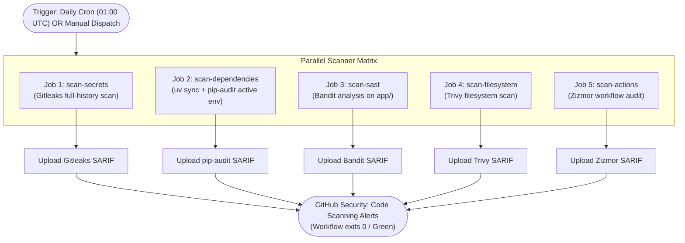

# CICD-002: Security Workflow Architecture

## Document Metadata
- **Workflow ID:** CICD-002
- **Workflow Name:** Periodic Security Scanning & Vulnerability Detection
- **Target GitHub Action:** `.github/workflows/jpra-security.yml`
- **Status:** Approved / Active
- **Author / Owner:** [@JuniorThanh]
- **Created Date:** 2026-09-27
- **Last Updated:** 2026-09-27

---

## 1. WHAT (Scope & Definition)
### 1.1 Objective
This workflow executes a comprehensive, daily security audit on the `main` branch. It orchestrates automated scans across secret exposure, dependency vulnerabilities, Python static application security testing (SAST), repository filesystem flaws, and GitHub Actions workflow security.

### 1.2 System Scope
- **Included Scanners & Checks:**
  - **Gitleaks:** Secret detection across git commit history.
  - **pip-audit:** CVE vulnerability scanning across installed Python dependencies via `uv`.
  - **Bandit:** Static security analysis targeting Python code flaws and dangerous patterns.
  - **Trivy:** Repository filesystem scanning for misconfigurations and vulnerable libraries.
  - **Zizmor:** Static analysis auditing GitHub Actions workflows against security anti-patterns.
- **Target Assets:** Application source code, configuration files, workflows, and synchronized dependencies.
- **Excluded:** Does not include CodeQL (delegated to `CICD-004`), Dependabot version bumps (delegated to `CICD-003`), or deployment runtime scans.

### 1.3 Key Deliverables & Outputs
Standardized SARIF (Static Analysis Results Interchange Format) reports uploaded directly to the GitHub Security Code Scanning tab, segmented by scanner category.

---

## 2. WHY (Motivation & Rationale)
### 2.1 Problem Statement
Although this project is an exploratory prototype, deploying a public Streamlit application and integrating external web scraping tools exposes attack vectors (e.g., leaked API credentials, compromised transitive dependencies, insecure workflow permissions). Without regular automated auditing, zero-day vulnerabilities in third-party packages can go unnoticed.

### 2.2 Security Objectives & Quality Attributes
- **Confidentiality:** Preventing accidental disclosure of API keys, database credentials, and service tokens.
- **Integrity:** Identifying known CVEs in upstream libraries before runtime execution.
- **Regulatory / Project Compliance:** Maintaining least-privilege security standards and safe GitHub Actions practices.

### 2.3 Architectural Alternatives & Trade-offs
- **Considered Alternatives:** Self-hosted Jenkins / SonarQube instances.
- **Selection Rationale:** Native GitHub Actions with parallel jobs eliminates infrastructure maintenance overhead, seamlessly integrates with GitHub Security dashboard, and costs zero runner minutes on public repositories.

---

## 3. HOW (Technical Architecture & Mechanics)
### 3.1 Execution Flow


### 3.2 Environment & Tool Configuration
- **Runner Environment:** `ubuntu-latest`
- **Tool Versions & Actions:**
  - Python runtime: 3.11+ managed with `uv`
  - Gitleaks: `gitleaks/gitleaks-action` (requires `fetch-depth: 0` for git history traversal)
  - pip-audit: Executed in-runner via `uv run pip-audit --format sarif`
  - Bandit: `bandit` generating SARIF output targeting `app/`
  - Trivy: `aquasecurity/trivy-action` (configured with `scan-type: fs` and `format: sarif`)
  - Zizmor: `zizmorcore/zizmor-action` auditing `.github/workflows/`

### 3.3 Security, Secrets & Permissions
- **GitHub Permissions:**
  ```yaml
  permissions:
    contents: read
    security-events: write
    actions: read
  ```
- **Required Secrets:** Built-in `GITHUB_TOKEN` for publishing SARIF reports to the Security API.
- **False-Positive Handling:**
  - Secrets: Suppressed via `.gitleaksignore`.
  - Python SAST: Managed via `.bandit` configuration.
  - Triage: Suppressed or dismissed directly inside the GitHub Security Code Scanning tab with documented rationale.

### 3.4 Failure Behavior & Escalation
- **Build Status Policy:** Informational and Non-Blocking (Green build). Scanners export findings to SARIF and complete with exit code 0.
- **Escalation Path:** Critical findings generate native GitHub Security alerts and maintainer email notifications for prompt review and remediation.

---

## 4. WHEN (Trigger Strategy & Conditions)
### 4.1 Trigger Events
- **Scheduled Runs:** `cron: '0 1 * * *'` (Daily at 01:00 UTC / 08:00 AM ICT).
- **Manual Trigger:** `workflow_dispatch` allowing on-demand full security audits.

### 4.2 Path & Branch Filters
- **Target Branch:** Strictly `main`.
- **Repository Scope:** Full repository scan to ensure holistic coverage.

### 4.3 Concurrency & Resource Limits
- **Timeout Limit:** 15 minutes per parallel job.
- **Concurrency Strategy:**
  ```yaml
  concurrency:
    group: security-audit
    cancel-in-progress: false
  ```

---

## 5. Acceptance & Verification Checklist
- [X] Workflow definition passes GitHub Actions YAML schema validation.
- [X] Parallel execution topology ensures isolated jobs run independently without blocking one another.
- [X] All scanners produce valid SARIF reports and upload to the GitHub Security tab.
- [X] Scheduled cron triggers reliably at 01:00 UTC.
- [X] Manual execution via `workflow_dispatch` triggers successfully on demand.
- [X] Scoped permissions strictly comply with Zizmor least-privilege standards.

---

## 6. Decision Date: Accepted in 2026-09-27
