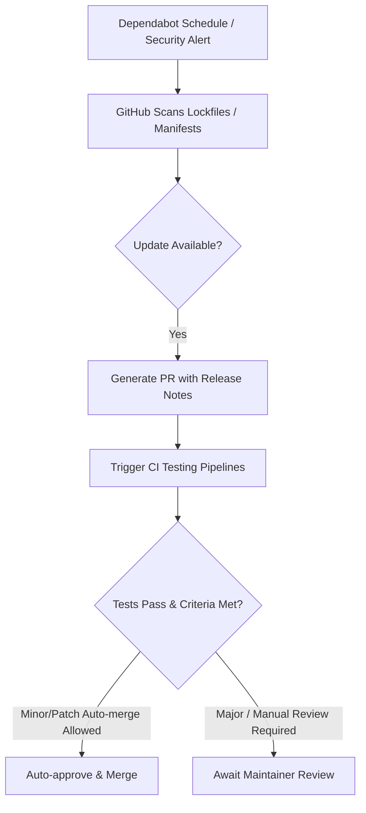

# CICD-003: Dependabot Workflow Architecture

## Document Metadata
- **Workflow ID:** CICD-003
- **Workflow Name:** Automated Dependency Management (Dependabot)
- **Target Configuration / Action:** `.github/dependabot.yml` & `.github/workflows/dependabot-auto-merge.yml`
- **Status:** Draft / Proposed
- **Author / Owner:** [@JuniorThanh]
- **Created Date:** [2026-09-27]
- **Last Updated:** [2026-09-27]

---

## 1. WHAT (Scope & Definition)
### 1.1 Objective
[Define the scope of automated package updates, patch monitoring, and dependency health.]

### 1.2 System Scope
- **Package Ecosystems Covered:** [e.g., `pip`, `github-actions`, `npm`]
- **Directories Monitored:** [e.g., root `/`, sub-projects]
- **Target Update Types:** [Security updates only vs. version upgrades (major/minor/patch)]

### 1.3 Key Deliverables & Outputs
[Automatic pull requests, changelog summaries, compatibility scores, and security advisory notifications.]

---

## 2. WHY (Motivation & Rationale)
### 2.1 Problem Statement
[Describe the risks of dependency decay, unpatched CVEs, and technical debt accumulation.]

### 2.2 Maintenance & Security Goals
- **CVE Mitigation Speed:** [Target SLA for addressing high/critical security advisories]
- **Technical Debt Reduction:** [Keeping libraries close to upstream releases]
- **Developer Overhead Reduction:** [Automating PR creation and basic compatibility validation]

### 2.3 Architectural Alternatives & Trade-offs
- **Considered Alternatives:** [Dependabot vs. Renovate Bot vs. manual periodic dependency bumps]
- **Trade-off Analysis:** [Evaluation of native GitHub integration vs. advanced grouping features]

---

## 3. HOW (Technical Architecture & Mechanics)
### 3.1 Execution Flow


### 3.2 Configuration Architecture
- **Ecosystem Setup:**
  - Package manager specifications: [Specify package manager]
  - Target branches: [e.g., main]
  - Open PR limit: [e.g., 5 to prevent PR spam]
- **Grouping Rules:** [Grouping minor/patch dependencies into single PRs]

### 3.3 Security, Secrets & Permissions
- **GitHub Permissions:**
  ```yaml
  permissions:
    contents: write
    pull-requests: write
  ```
- **Auto-merge & Approval Strategy:** [Rules for GitHub native auto-merge or gh CLI actions]
- **Secret Access Limitations:** [Handling workflow runs initiated by Dependabot actor]

### 3.4 Failure Behavior & Conflict Resolution
- **Rebase Policy:** [Automatic rebasing on target branch updates]
- **Broken Build Triage:** [Handling breaking changes or incompatible transitive dependencies]

---

## 4. WHEN (Trigger Strategy & Conditions)
### 4.1 Check Intervals & Schedules
- **Regular Updates Schedule:** [e.g., weekly on Mondays at 00:00 UTC]
- **Security Alerts:** [Immediate trigger upon newly disclosed GitHub Advisory CVEs]

### 4.2 Auto-Merge Triggers
- **Evaluation Events:** [e.g., `pull_request_target` when PR review is requested or CI finishes]
- **Filter Conditions:** [Actor is `dependabot[bot]`, semver level is minor or patch]

---

## 5. Acceptance & Verification Checklist
- [ ] Valid `.github/dependabot.yml` syntax recognized by GitHub Settings.
- [ ] Dependabot successfully creates test PRs when dependencies have updates.
- [ ] Standard CI checks run automatically against Dependabot pull requests.
- [ ] Auto-merge functions securely without unauthorized permission elevation.
