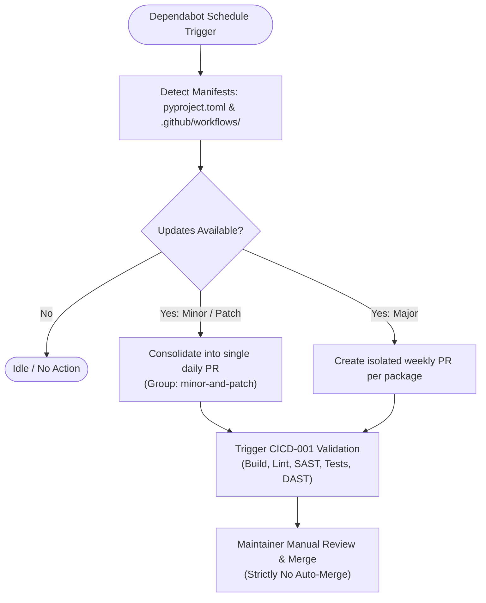

# CICD-003: Dependabot Workflow Architecture

## Document Metadata
- **Workflow ID:** CICD-003
- **Workflow Name:** Automated Dependency Management (Dependabot)
- **Target Configuration:** `.github/dependabot.yml`
- **Status:** Approved / Active
- **Author / Owner:** [@JuniorThanh]
- **Created Date:** 2026-09-27
- **Last Updated:** 2026-09-27

---

## 1. WHAT (Scope & Definition)
### 1.1 Objective
This workflow automates dependency monitoring and pull request generation across application libraries and GitHub Actions. Dependency updates are divided into two operational tiers: minor and patch updates are consolidated into a single daily pull request, while major upgrades are isolated into individual weekly pull requests to ensure stability and reduce maintainer review fatigue.

### 1.2 System Scope
- **Package Ecosystems Covered:**
  - `github-actions`: Workflow actions defined under `.github/workflows/`.
  - `pip`: Python packages declared in [`pyproject.toml`](file:///home/kisunecaneld/Desktop/MyProjects/AIJMC-JPRA/pyproject.toml) and synchronized via [`uv.lock`](file:///home/kisunecaneld/Desktop/MyProjects/AIJMC-JPRA/uv.lock).
- **Directories Monitored:** Repository root (`/`).
- **Target Update Types:** Version upgrades covering major, minor, and patch levels.

### 1.3 Key Deliverables & Outputs
- Automated pull requests containing changelogs, release notes, and commit comparison links.
- Mandatory **40-character commit SHAs** for GitHub Actions (replacing floating `@v*` tags to satisfy Zizmor and OpenSSF Scorecard standards).
- Synchronized version updates across both `pyproject.toml` and `uv.lock`.

---

## 2. WHY (Motivation & Rationale)
### 2.1 Problem Statement
Without automated dependency tracking, packages suffer from version decay, accumulating unpatched security vulnerabilities and technical debt. Conversely, unmanaged individual PRs flood maintainers with noise. A tiered grouping strategy ensures controlled, predictable upgrades.

### 2.2 Maintenance & Security Goals
- **CVE Mitigation Speed:** Rapid remediation of high and critical security advisories.
- **Technical Debt Reduction:** Keeps foundational libraries close to upstream releases without manual tracking.
- **Maintainer Overhead Reduction:** Combines routine minor/patch bumps into a single daily review bundle.

### 2.3 Architectural Alternatives & Trade-offs
- **Considered Alternatives:** Dependabot vs. Renovate Bot vs. manual quarterly bumps.
- **Trade-off Analysis:** Dependabot provides native GitHub integration with zero external infrastructure or third-party token management, making it optimal for rapid prototyping.

---

## 3. HOW (Technical Architecture & Mechanics)
### 3.1 Execution Flow

### 3.2 Configuration Architecture
- **Ecosystem Setup in `.github/dependabot.yml`:**
  - `package-ecosystem: "github-actions"`
    - Directory: `/`
    - Schedule: Daily at `02:00 UTC`
    - Commit message prefix: `ci(actions)`
  - `package-ecosystem: "pip"`
    - Directory: `/`
    - Schedule: Daily at `02:00 UTC`
    - Groups: `minor-and-patch` (groups all non-breaking updates)
    - Commit message prefix: `deps(python)`
- **Open PR Limit:** Capped at 5 concurrent PRs to prevent backlog saturation.

### 3.3 Security, Secrets & Permissions
- **GitHub Permissions:** Standard GitHub Dependabot service permissions.
- **Auto-Merge Policy:** **Strictly No Auto-Merge**. All pull requests (minor, patch, and major) require explicit manual review and approval by the repository maintainer.
- **Commit SHA Pinning:** Configured so GitHub Actions use immutable commit SHAs with inline version comments.

### 3.4 Failure Behavior & Conflict Resolution
- **Rebase Policy:** Automatic rebasing enabled (`rebase-strategy: "auto"`) so PRs stay up to date with `main`.
- **Broken Build Triage:** If a Dependabot PR fails `CICD-001` verification, the maintainer reviews the breaking changes and either applies necessary code fixes or closes/ignores the PR.

---

## 4. WHEN (Trigger Strategy & Conditions)
### 4.1 Check Intervals & Schedules
- **Minor & Patch Updates:** Daily at `02:00 UTC` (09:00 AM ICT).
- **Major Updates:** Weekly on Mondays at `02:00 UTC`.
- **Security Alerts:** Immediate on-demand pull requests triggered upon newly published GitHub Advisory CVEs.

### 4.2 Auto-Merge Triggers
- **Status:** Disabled. No automated merging triggers or helper actions are deployed.

---

## 5. Acceptance & Verification Checklist
- [X] Configuration file `.github/dependabot.yml` complies with GitHub YAML specification.
- [X] Monitored ecosystems encompass both `github-actions` and `pip` (`pyproject.toml` + `uv.lock`).
- [X] Minor and patch dependencies are consolidated into single review pull requests.
- [X] Major version upgrades are isolated into dedicated individual pull requests.
- [X] GitHub Actions pull requests mandate 40-character commit SHAs.
- [X] Auto-merge is explicitly disabled; all dependency updates require manual maintainer approval.

---

## 6. Decision Date: Accepted in 2026-09-27
