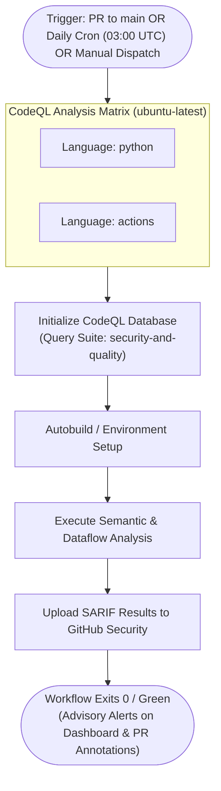

# CICD-004: CodeQL Workflow Architecture

## Document Metadata
- **Workflow ID:** CICD-004
- **Workflow Name:** Static Application Security Testing (CodeQL)
- **Target GitHub Action:** `.github/workflows/codeql.yml`
- **Status:** Approved / Active
- **Author / Owner:** [@JuniorThanh]
- **Created Date:** 2026-09-27
- **Last Updated:** 2026-09-27

---

## 1. WHAT (Scope & Definition)
### 1.1 Objective
This workflow orchestrates deep static semantic analysis and dataflow taint tracking using GitHub CodeQL. It examines codebases to uncover complex security vulnerabilities, taint-propagation paths (from untrusted user/scraped inputs to critical sinks), and software maintainability anti-patterns across the `main` branch and incoming pull requests.

### 1.2 System Scope
- **Languages Analyzed:** `python` and `actions` (auditing workflow configurations).
- **Query Suites Selected:** `security-and-quality` (comprehensive coverage spanning OWASP vulnerabilities, CWE security risks, and code maintainability heuristics).
- **Excluded Directories / Vendor Code:** Third-party libraries (`.venv/`), compiled assets, documentation, and raw datasets.

### 1.3 Key Deliverables & Outputs
- Standardized SARIF vulnerability reports published directly to the GitHub Security Code Scanning tab.
- Contextual pull request annotations highlighting flagged lines in the Files Changed view.

---

## 2. WHY (Motivation & Rationale)
### 2.1 Problem Statement
In an application that ingests arbitrary recruitment URLs and parses dynamic DOM trees, simple pattern-matching linters cannot trace dataflow paths. Without semantic graph analysis, dangerous flaws (e.g., SSRF, path traversal, injection, unsafe deserialization, or unhandled exceptions) can easily bypass basic linters.

### 2.2 Security & Maintainability Goals
- **Dataflow Vulnerability Detection:** Traces untrusted external inputs (scraped HTML, external job URLs) from entry points to sinks.
- **Code Hygiene & Best Practices:** Detects unreachable code, resource leaks, variable shadowing, and logic antipatterns before they manifest as runtime errors.
- **Zero-False-Sense-of-Security:** Leverages formal Abstract Syntax Tree (AST) graph queries to provide rigorous assurance.

### 2.3 Architectural Alternatives & Trade-offs
- **Considered Tools:** CodeQL vs. SonarQube vs. Semgrep.
- **Selection Rationale:** CodeQL provides the industry standard for inter-procedural dataflow taint analysis within GitHub, requires zero external server infrastructure, and seamlessly updates the native Security Code Scanning tab without third-party tokens.

---

## 3. HOW (Technical Architecture & Mechanics)
### 3.1 Execution Flow


### 3.2 Environment & Build Specifications
- **Runner Environment:** `ubuntu-latest`
- **Matrix Strategy:**
  ```yaml
  strategy:
    fail-fast: false
    matrix:
      language: ['python', 'actions']
  ```
- **Runtime Setup:** Python 3.11+ environment initialized for the Python analysis job.
- **Action Suite:** Official `github/codeql-action/init` and `github/codeql-action/analyze`.

### 3.3 Security, Secrets & Permissions
- **GitHub Permissions:**
  ```yaml
  permissions:
    contents: read
    security-events: write
    actions: read
  ```
- **Required Secrets:** Built-in `GITHUB_TOKEN`.
- **False-Positive Triage:** Dismissals and suppressions are triaged directly in the GitHub Security Code Scanning tab with mandatory justification notes.

### 3.4 Failure Behavior & Resolution
- **Blocking Status Policy:** Advisory & Non-Blocking (Green build). Scanners export findings to SARIF and complete with exit code 0.
- **Resolution Workflow:** Developers inspect inline PR annotations and Security tab alerts to address flagged code before or after merging.

---

## 4. WHEN (Trigger Strategy & Conditions)
### 4.1 Trigger Events
- **Pull Request Events:** `[opened, synchronize, reopened]` targeting `main`.
- **Scheduled Runs:** `cron: '0 3 * * *'` (Daily at 03:00 UTC / 10:00 AM ICT).
- **Manual Trigger:** `workflow_dispatch` for on-demand deep analysis.

### 4.2 Path & Branch Filters
- **Target Branches:** `main`.
- **Monitored Paths:** Application source code (`app/**`), tests, and GitHub workflows (`.github/workflows/**`).
- **Ignored Paths:** Documentation (`docs/**`, `*.md`, `LICENSE`).

### 4.3 Concurrency & Performance
- **Concurrency Strategy:**
  ```yaml
  concurrency:
    group: codeql-${{ github.event.pull_request.number || github.ref }}
    cancel-in-progress: true
  ```
- **Resource Management:** Automatic cancellation of redundant in-flight PR runs conserves runner minutes.

---

## 5. Acceptance & Verification Checklist
- [X] Workflow definition passes GitHub Actions YAML schema validation.
- [X] CodeQL database initializes and analyzes both `python` and `actions` languages.
- [X] Query suite is configured to `security-and-quality`.
- [X] Pull requests generate inline annotations on affected lines of code.
- [X] Scheduled daily baseline audit triggers at 03:00 UTC and exits green after uploading SARIF.
- [X] Scoped permissions strictly comply with Zizmor least-privilege standards.

---

## 6. Decision Date: Accepted in 2026-09-27
