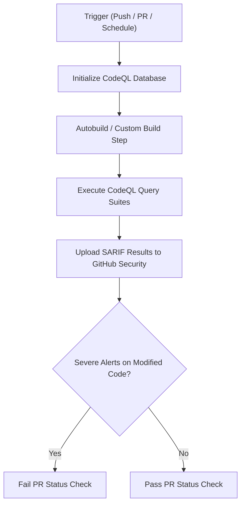

# CICD-004: CodeQL Workflow Architecture

## Document Metadata
- **Workflow ID:** CICD-004
- **Workflow Name:** Static Application Security Testing (CodeQL)
- **Target GitHub Action:** `.github/workflows/codeql.yml`
- **Status:** Draft / Proposed
- **Author / Owner:** [@JuniorThanh]
- **Created Date:** [2026-09-27]
- **Last Updated:** [2026-09-27]
 
---

## 1. WHAT (Scope & Definition)
### 1.1 Objective
[Define the scope of deep semantic and dataflow static analysis using GitHub CodeQL.]

### 1.2 System Scope
- **Languages Analyzed:** [e.g., `python`, `actions`]
- **Query Suites Selected:** [e.g., `security-extended` or `security-and-quality`]
- **Excluded Directories / Vendor Code:** [Third-party libraries, compiled assets, auto-generated code]

### 1.3 Key Deliverables & Outputs
[SARIF vulnerability reports, Code Scanning alerts on GitHub Security dashboard, PR review annotations.]

---

## 2. WHY (Motivation & Rationale)
### 2.1 Problem Statement
[Describe semantic code defects, data taint issues, injection vulnerabilities, and algorithmic flaws addressed.]

### 2.2 Security & Maintainability Goals
- **Dataflow Vulnerability Detection:** [Tracing untrusted inputs (e.g. scraped HTML, user URLs) to sinks]
- **Code Hygiene & Best Practices:** [Catching unreachable code, resource leaks, logic antipatterns]
- **Zero-False-Sense-of-Security:** [Balancing deep AST analysis with build time efficiency]

### 2.3 Architectural Alternatives & Trade-offs
- **Considered Tools:** [CodeQL vs. SonarQube vs. Semgrep]
- **Selection Rationale:** [Why CodeQL is selected for semantic graph analysis in GitHub ecosystem]

---

## 3. HOW (Technical Architecture & Mechanics)
### 3.1 Execution Flow


### 3.2 Environment & Build Specifications
- **Runner Environment:** [e.g., ubuntu-latest]
- **Build Step Requirements:** [Compiled languages vs. interpreted languages setup]
- **Query Configuration:** [Custom `.github/codeql/codeql-config.yml` if queries are customized]

### 3.3 Security, Secrets & Permissions
- **GitHub Permissions:**
  ```yaml
  permissions:
    contents: read
    security-events: write
    actions: read
  ```
- **Resource Limits:** [RAM / CPU constraints and database caching]

### 3.4 Failure Behavior & Resolution
- **Blocking Status Checks:** [Is this a mandatory blocking check for PR merge?]
- **Triage Process:** [Workflow for reviewing false positives and marking alerts as dismissed/fixed]

---

## 4. WHEN (Trigger Strategy & Conditions)
### 4.1 Trigger Events
- **Push Events:** [Target branches, e.g., `main`]
- **Pull Request Events:** [Target branches, e.g., `main`]
- **Cron Schedule:** [e.g., `cron: '0 3 * * 0'` (Weekly Sunday run)]

### 4.2 Path & Branch Filters
- **Monitored Paths:** [Source files, application packages]
- **Ignored Paths:** [Documentation, non-code assets, raw data files]

### 4.3 Concurrency & Performance
- **Concurrency Grouping:** [Cancel superseded PR scans to conserve GitHub Actions minutes]
- **Estimated Runtime:** [Target duration threshold]

---

## 5. Acceptance & Verification Checklist
- [ ] CodeQL database initializes and builds without compilation errors.
- [ ] Queries run and export valid SARIF records to the repository Security tab.
- [ ] PR checks annotate flagged code lines directly in the Files Changed view.
- [ ] Scheduled weekly baseline scan completes successfully without runner timeout.
