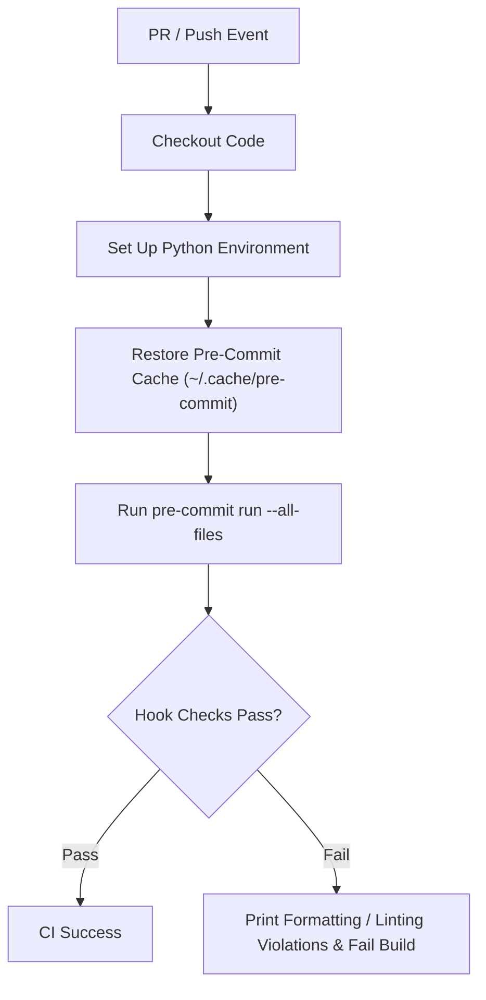

# CICD-005: Pre-Commit Workflow Architecture

## Document Metadata
- **Workflow ID:** CICD-005
- **Workflow Name:** Pre-Commit & Code Quality Gate
- **Target GitHub Action:** `.github/workflows/pre-commit.yml`
- **Status:** Draft / Proposed
- **Author / Owner:** [@JuniorThanh]
- **Created Date:** [2026-09-27]
- **Last Updated:** [2026-09-27]

---

## 1. WHAT (Scope & Definition)
### 1.1 Objective
[Define the scope of server-side code quality, style formatting, and static linter enforcement.]

### 1.2 System Scope
- **Included Hook Checks:** [e.g., ruff format, ruff check, check-yaml, end-of-file-fixer, trailing-whitespace]
- **Governed File Types:** [Python files, YAML, JSON, Markdown, Shell scripts]
- **Config Authority:** [Mastered by `.pre-commit-config.yaml` at repository root]

### 1.3 Key Deliverables & Outputs
[Linting validation results, automated formatting check, and PR blocker status.]

---

## 2. WHY (Motivation & Rationale)
### 2.1 Problem Statement
[Describe code drift, inconsistent styling, subtle syntax bugs, and noisy diffs without automated enforcement.]

### 2.2 Quality Goals & Benefits
- **Stylistic Uniformity:** [Ensuring consistent code format across all contributors]
- **Early Bug Detection:** [Catching undefined variables, unused imports, or bad syntax before unit tests]
- **Local-to-CI Parity:** [Ensuring identical rules locally (`pre-commit run`) and on GitHub Actions]

### 2.3 Architectural Alternatives & Trade-offs
- **Considered Options:** [Running individual linters directly vs. orchestrating via pre-commit framework]
- **Trade-off Analysis:** [Standardization and version pinning benefits vs. dependency overhead]

---

## 3. HOW (Technical Architecture & Mechanics)
### 3.1 Execution Flow


### 3.2 Environment & Runner Specifications
- **Runner OS:** [e.g., ubuntu-latest]
- **Python Version:** [Specify Python version matching runtime requirements]
- **Caching Strategy:**
  - Cache target: `~/.cache/pre-commit`
  - Cache key formulation: [Specify hashFiles matching `.pre-commit-config.yaml`]

### 3.3 Security, Secrets & Permissions
- **GitHub Permissions:**
  ```yaml
  permissions:
    contents: read
  ```
- **Required Secrets:** [Specify if any or note that none are required]

### 3.4 Developer Remediation Guide
- **Local Resolution Command:** [e.g., `pre-commit run --all-files` or `ruff check --fix`]
- **Automated Fix Integration:** [Optional auto-fix commit bot vs. strict developer manual remediation]

---

## 4. WHEN (Trigger Strategy & Conditions)
### 4.1 Trigger Events
- **Primary Triggers:** [e.g., `pull_request`, `push` to main]
- **Event Types:** [e.g., `opened`, `synchronize`, `reopened`]

### 4.2 Path & File Filters
- **Monitored Extensions:** [e.g., `**/*.py`, `**/*.yaml`, `**/*.yml`, `**/*.json`, `**/*.md`]
- **Skipped Paths:** [e.g., generated documentation or test datasets]

### 4.3 Concurrency & Performance
- **Concurrency Grouping:** [Cancel redundant runs on rapid branch pushes]
- **Target Execution Duration:** [< 2 minutes target runtime]

---

## 5. Acceptance & Verification Checklist
- [ ] Hook configurations strictly mirror local `.pre-commit-config.yaml`.
- [ ] Environment caching reliably accelerates repeat workflow runs.
- [ ] Non-compliant code consistently triggers workflow failure with clear line annotations.
- [ ] Passes cleanly on clean codebase without false alarms.
