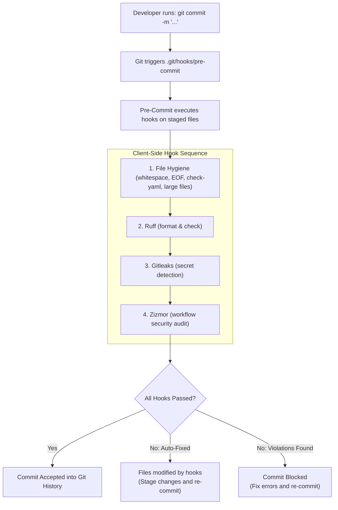

# CICD-005: Local Pre-Commit Hook Architecture

## Document Metadata
- **Workflow ID:** CICD-005
- **Workflow Name:** Local Pre-Commit Quality Gate
- **Target Configuration:** `.pre-commit-config.yaml`
- **Execution Target:** Client-Side Git Hook (`.git/hooks/pre-commit`)
- **Status:** Approved / Active
- **Author / Owner:** [@JuniorThanh]
- **Created Date:** 2026-09-27
- **Last Updated:** 2026-09-27

---

## 1. WHAT (Scope & Definition)
### 1.1 Objective
This specification defines the client-side pre-commit quality gate. It runs locally and automatically on the developer's workstation upon executing `git commit`. It acts as the first line of defense, preventing malformatted code, syntax errors, secret leaks, and unvetted GitHub Actions configurations from ever entering the git commit history.

### 1.2 System Scope
- **Included Hooks & Tools:**
  - **Git Hygiene:** `trailing-whitespace`, `end-of-file-fixer`, `check-yaml`, `check-added-large-files` (blocks binary blobs > 500KB).
  - **Python Formatting & Linting:** `ruff` (`ruff check` and `ruff format`) for near-instant linting and styling.
  - **Local Security Checks:** `gitleaks` (pre-commit secret detection) and `zizmor` (auditing `.github/workflows/` against insecure action patterns).
- **Governed File Types:** Python (`*.py`), YAML (`*.yaml`, `*.yml`), Markdown (`*.md`), JSON, and shell scripts.
- **Config Authority:** Centrally managed by [`.pre-commit-config.yaml`](file:///home/kisunecaneld/Desktop/MyProjects/AIJMC-JPRA/.pre-commit-config.yaml) at the repository root.
- **Excluded:** Does not run as a remote GitHub Action workflow in the cloud; it operates exclusively on the local development environment.

### 1.3 Key Deliverables & Outputs
- Automated formatting fixes (auto-stripping whitespace, newline normalization).
- Terminal feedback blocking non-compliant commits before they are recorded in git history.

---

## 2. WHY (Motivation & Rationale)
### 2.1 Problem Statement
Without automated client-side checks, developers accidentally commit trailing spaces, syntax anomalies in YAML files, unformatted Python files, or hardcoded API keys. Catching these errors only after pushing to remote CI wastes time and clutters the commit history with trivial fixup commits.

### 2.2 Quality Goals & Benefits
- **Shift-Left Quality:** Defect identification occurs at the earliest possible moment—directly in the local terminal.
- **Zero CI Cycle Waste:** Eliminates failed CI builds caused by trivial syntax or formatting issues.
- **Developer Flow:** Rust-powered tooling (`ruff`) delivers feedback in under 2 seconds without disrupting developer velocity.

### 2.3 Architectural Alternatives & Trade-offs
- **Considered Alternatives:** Cloud-only CI verification vs. manual pre-push scripts vs. client-side Git hooks.
- **Selection Rationale:** Native Git hooks managed via `pre-commit` execute automatically on staged files during `git commit`, ensuring effortless compliance without manual script execution.

---

## 3. HOW (Technical Architecture & Mechanics)
### 3.1 Execution Flow


### 3.2 Environment & Tool Configuration
- **Prerequisites:** Python 3.11+ environment with `pre-commit` installed via `uv`.
- **Installation Command:**
  ```bash
  uv run pre-commit install
  ```
- **Caching Mechanism:** Hook environments and dependencies are cached locally in `~/.cache/pre-commit` for fast subsequent runs.

### 3.3 Security, Secrets & Permissions
- **Security Role:** Intercepts accidental inclusion of secrets (`.env`, private keys, Groq/Gemini tokens) before the commit object is created.
- **Bypass Safeguards:** Can only be intentionally bypassed with `git commit --no-verify`, which is restricted by policy.

### 3.4 Developer Remediation Guide
- **Automatic Fixes:** When hooks like `end-of-file-fixer` or `ruff format` modify files, simply restage the files (`git add .`) and re-run `git commit`.
- **Manual Lint / Security Errors:** Review terminal error messages, resolve the flagged violations in code, and commit.
- **Full Repository Check:** Run `uv run pre-commit run --all-files` anytime to validate all files across the repository.

---

## 4. WHEN (Trigger Strategy & Conditions)
### 4.1 Trigger Events
- **Primary Trigger:** Automatically fires on every local `git commit` invocation.
- **Manual Trigger:** On-demand execution via terminal command `uv run pre-commit run --all-files`.

### 4.2 File Scope & Filtering
- **Default Behavior:** Only inspects **staged files** (`git diff --cached`) for optimal speed (< 2 seconds).
- **Target Extensions:** `**/*.py`, `**/*.yaml`, `**/*.yml`, `**/*.md`, `**/*.json`, `**/*.sh`.

---

## 5. Acceptance & Verification Checklist
- [X] Root `.pre-commit-config.yaml` is valid and contains standard hygiene, Ruff, Gitleaks, and Zizmor hooks.
- [X] Hook execution takes less than 3 seconds on staged files.
- [X] Local `git commit` automatically invokes the pre-commit pipeline.
- [X] Commits containing trailing whitespace or formatting violations are blocked.
- [X] Secret detection blocks commits containing sensitive credentials.
- [X] Cloud GitHub Action workflow is excluded (local client-side gate only).

---

## 6. Decision Date: Accepted in 2026-09-27
