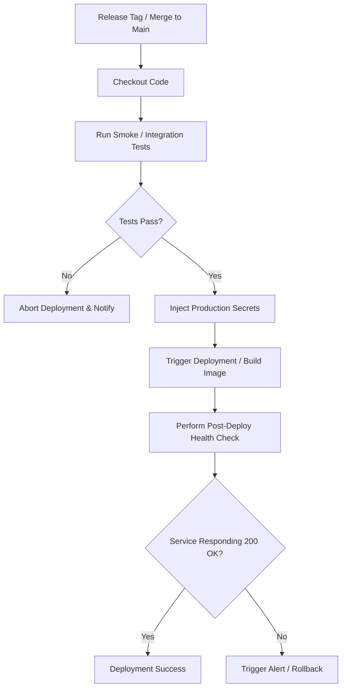

# CICD-006: Streamlit Deployment Workflow Architecture

## Document Metadata
- **Workflow ID:** CICD-006
- **Workflow Name:** Streamlit Application Deployment Pipeline
- **Target GitHub Action:** `.github/workflows/streamlit-deployment.yml`
- **Status:** Draft / Proposed
- **Author / Owner:** [@JuniorThanh]
- **Created Date:** [2026-09-27]
- **Last Updated:** [2026-09-27]

---

## 1. WHAT (Scope & Definition)
### 1.1 Objective
[Define the scope of deploying the JPRA Streamlit user interface and backend services to the hosting platform.]

### 1.2 System Scope
- **Target Deployment Platform:** [e.g., Streamlit Community Cloud / Render / Docker Container on Cloud VM]
- **Deployed Components:** [Frontend dashboard, PydanticAI agent orchestrator, API bridges]
- **Environment Tiers:** [Staging vs. Production deployment targets]

### 1.3 Key Deliverables & Outputs
[Live service endpoint URL, deployment status badge, release tag artifacts, health check audit logs.]

---

## 2. WHY (Motivation & Rationale)
### 2.1 Problem Statement
[Describe the operational risks of manual deployments, secret mismanagement, and service downtime.]

### 2.2 Availability & Delivery Goals
- **Continuous Delivery:** [Automatic deployment of verified releases to end-users]
- **Zero Downtime / Rollback Safety:** [Strategy for rolling updates or rapid rollback on failures]
- **Environment Parity:** [Ensuring identical environment variables and runtime configurations]

### 2.3 Architectural Alternatives & Trade-offs
- **Considered Platforms:** [Streamlit Community Cloud webhook vs. Containerized deployment (Docker + Cloud Run / VPS)]
- **Trade-off Analysis:** [Ease of deployment vs. environment customizability and cold-start latency]

---

## 3. HOW (Technical Architecture & Mechanics)
### 3.1 Execution Flow


### 3.2 Environment & Build Specifications
- **Runtime Environment:** [Python version, OS baseline, system libraries like libglib / chromium dependencies]
- **Build & Packaging:** [Dockerfile containerization vs. virtual environment package restoration]

### 3.3 Security, Secrets & Permissions
- **GitHub Permissions:**
  ```yaml
  permissions:
    contents: read
    deployments: write
  ```
- **Required Production Secrets:**
  - `GEMINI_API_KEY`: [Google Gen SDK authentication]
  - `GROQ_API_KEY`: [Groq LPU inference key]
  - `SUPABASE_URL` & `SUPABASE_KEY`: [Supabase database credentials]
  - `DEPLOY_WEBHOOK_URL` / `CLOUD_CREDENTIALS`: [Deployment authentication]
- **Secret Isolation:** [Use of GitHub Environments (e.g. `production`) with protection rules]

### 3.4 Verification, Health Check & Rollback
- **Post-Deploy Health Check:** [Endpoint URL validation command, e.g. curl health endpoint]
- **Rollback Procedure:** [Step-by-step process for reverting to prior known-good commit]

---

## 4. WHEN (Trigger Strategy & Conditions)
### 4.1 Trigger Events
- **Primary Triggers:** [e.g., Release tag creation `v*.*.*` or push to `main` following PR merge]
- **Manual Trigger:** [`workflow_dispatch` with environment selection]

### 4.2 Branch & Environment Gates
- **Target Branch:** [e.g., `main`]
- **Required Preconditions:** [Mandatory passing of `CICD-001` through `CICD-005` before deployment triggers]

### 4.3 Concurrency & Deployment Locking
- **Concurrency Group:** `production-deployment`
- **Cancel in Progress:** false (never cancel mid-deployment to avoid inconsistent state)

---

## 5. Acceptance & Verification Checklist
- [ ] Staging/production secrets are securely bound to GitHub Environments.
- [ ] Upstream testing gates must succeed before deployment initiates.
- [ ] Post-deployment health verification script validates UI responsiveness.
- [ ] Rollback strategy is documented and validated.
