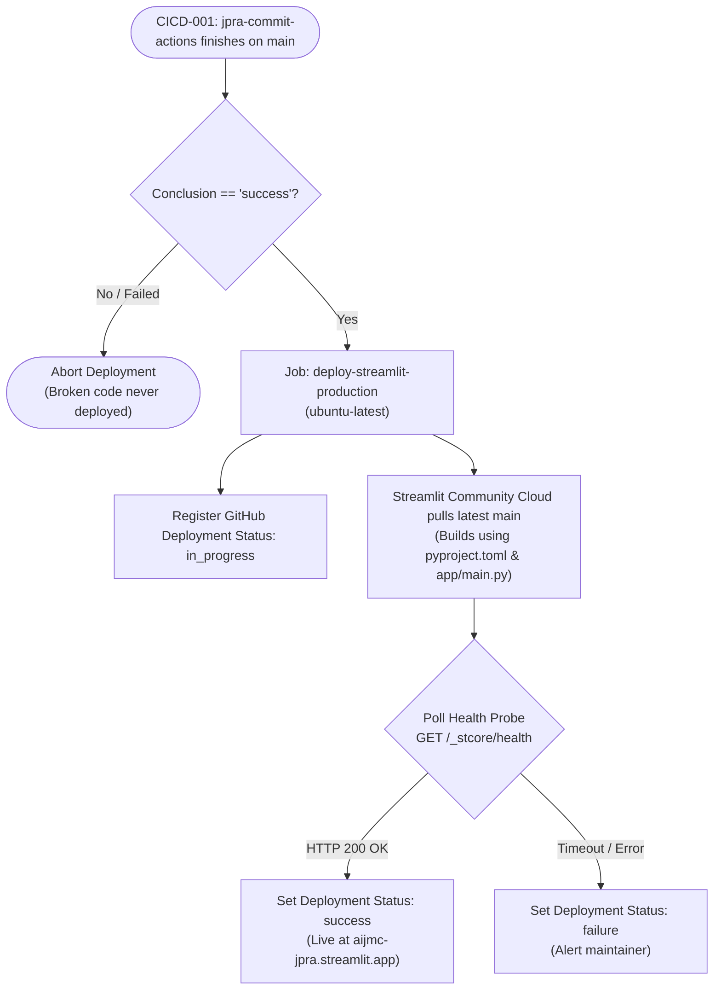

# CICD-006: Streamlit Deployment Workflow Architecture

## Document Metadata
- **Workflow ID:** CICD-006
- **Workflow Name:** Streamlit Application Deployment Pipeline
- **Target GitHub Action:** `.github/workflows/jpra-streamlit-deployment.yml`
- **Target Platform:** Streamlit Community Cloud
- **Application Entry Point:** `app/main.py`
- **Status:** Approved / Active
- **Author / Owner:** [@JuniorThanh]
- **Created Date:** 2026-09-27
- **Last Updated:** 2026-09-27

---

## 1. WHAT (Scope & Definition)
### 1.1 Objective
This workflow manages the continuous delivery lifecycle for the JPRA Streamlit user interface and AI analysis services on Streamlit Community Cloud. It operates as a strict deployment gate: deployment verification and post-deploy health validation only trigger on the `main` branch after `CICD-001-commit-actions-workflow` has successfully completed all five validation stages.

### 1.2 System Scope
- **Included:**
  - Automated triggering contingent upon `CICD-001` (`jpra-commit-actions`) green completion.
  - Verification of Streamlit configuration, entry point (`app/main.py`), and dependencies (`pyproject.toml`).
  - Post-deployment live health verification pinging the `/_stcore/health` endpoint of the live application.
  - GitHub Deployment status reporting (environment: `production`).
- **Excluded:**
  - Pre-deployment tests and SAST/DAST checks (handled upstream in `CICD-001`).
  - PR/feature-branch deployments (production deployment targets `main` only).

### 1.3 Key Deliverables & Outputs
- Active deployment tracking in GitHub Deployments dashboard.
- Verified live service endpoint (e.g., `https://aijmc-jpra.streamlit.app`).
- Health check audit log confirming runtime readiness.

---

## 2. WHY (Motivation & Rationale)
### 2.1 Problem Statement
Deploying unverified code directly to a live demonstration environment causes service outages, broken UI components, and potential exposure of non-functional features to research evaluators. Gating deployment behind a verified CI pipeline guarantees that only vetted, fully tested code is served in production.

### 2.2 Quality Goals & Benefits
- **Zero-Regret Deployment:** New versions only reach the live environment after passing build checks, linting, SAST, automated tests, and DAST.
- **Automated Health Auditing:** Guarantees that the Streamlit backend worker and web socket handlers are operational immediately post-release.
- **Traceability:** Correlates live deployments directly to git commit hashes on `main`.

### 2.3 Architectural Alternatives & Trade-offs
- **Considered Platforms:** Streamlit Community Cloud vs. Containerized deployment on Cloud Run / VPS.
- **Selection Rationale:** Streamlit Community Cloud offers zero-cost managed hosting, automated TLS, and native GitHub repository synchronization, ideal for research prototypes. Gating it via GitHub Actions provides enterprise-grade release control.

---

## 3. HOW (Technical Architecture & Mechanics)
### 3.1 Execution Flow


### 3.2 Environment & Build Specifications
- **Runner OS:** `ubuntu-latest`
- **Application Configuration:**
  - Entry point: `app/main.py`
  - Python version: 3.11+
  - Dependencies: Managed via `pyproject.toml`
  - Headless mode: `server.headless = true` configured in `.streamlit/config.toml`

### 3.3 Security, Secrets & Permissions
- **GitHub Permissions:**
  ```yaml
  permissions:
    contents: read
    deployments: write
  ```
- **Secrets Management:**
  - Runtime API keys (`GEMINI_API_KEY`, `GROQ_API_KEY`, `SUPABASE_URL`, `SUPABASE_KEY`) are managed securely inside the **Streamlit Community Cloud Secrets Dashboard** (TOML format), ensuring zero secret exposure in GitHub runner logs.
  - Optional `STREAMLIT_APP_URL` stored as a GitHub Environment variable.

### 3.4 Post-Deployment Health Verification & Rollback
- **Health Check Strategy:** The runner executes a polling loop against the application's health endpoint:
  ```bash
  curl --fail --retry 15 --retry-delay 5 --retry-all-errors https://${STREAMLIT_APP_URL}/_stcore/health
  ```
- **Rollback Procedure:** If the health probe fails after deployment, the maintainer reverts the merge commit on `main` via `git revert`, automatically restoring the previous stable build.

---

## 4. WHEN (Trigger Strategy & Conditions)
### 4.1 Trigger Events
- **Primary Trigger (Chained CI Gate):**
  ```yaml
  on:
    workflow_run:
      workflows: ["jpra-commit-actions"]
      branches: [main]
      types: [completed]
    workflow_dispatch:
  ```
- **Execution Condition:**
  ```yaml
  if: ${{ github.event_name == 'workflow_dispatch' || github.event.workflow_run.conclusion == 'success' }}
  ```

### 4.2 Branch & Environment Gates
- **Target Branch:** Strictly `main`.
- **Environment:** `production` (configured with GitHub Environment protection rules).

### 4.3 Concurrency & Deployment Locking
- **Concurrency Group:**
  ```yaml
  concurrency:
    group: streamlit-production-deployment
    cancel-in-progress: false
  ```
- *Rationale:* `cancel-in-progress: false` prevents terminating a deployment mid-cycle, guaranteeing deployment atomicity.

---

## 5. Acceptance & Verification Checklist
- [X] Workflow triggers automatically on `main` when `jpra-commit-actions` succeeds.
- [X] Deployment is aborted if any upstream stage in `CICD-001` fails.
- [X] Application entry point is verified as `app/main.py`.
- [X] Post-deployment health probe validates live `_stcore/health` responsiveness.
- [X] Production secrets are isolated within Streamlit Community Cloud settings.
- [X] Concurrency prevents overlapping simultaneous deployments.

---

## 6. Decision Date: Accepted in 2026-09-27
